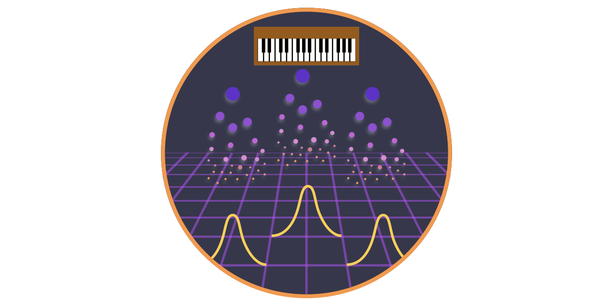

.. popsynth documentation master file, created by
   sphinx-quickstart on Mon Aug 19 11:40:04 2019.
   You can adapt this file completely to your liking, but it should at least
   contain the root `toctree` directive.

Welcome to popsynth's documentation!
====================================

This framework provides an abstract way to generate populations from
various luminosity functions and redshift distributions. Additionally,
auxiliary quantities can be sampled and stored.

Populations can be saved and restored via an HDF5 files for later
use. Population synthesis routines can be created via classes or
structured YAML files.

Users can construct their own classes for spatial, luminosity,
etc. distributions which can all be connected to arbitrarily complex
selection functions.

.. note:: This is *not* Synth Pop. If you were expecting that… I suggest you check out Depeche Mode. Though, it is possible to combine coding and good music_.

.. image:: ../external/pop.gif

.. _music: https://open.spotify.com/playlist/601WLbJ3Vj91XIugGUJNUe?si=JuXYC9roSxm2PS51aqVaJw

.. toctree::
   :maxdepth: 3
   :hidden:

   notebooks/quickstart.ipynb
   notebooks/selections.ipynb
   notebooks/aux.ipynb
   notebooks/custom.ipynb
   notebooks/milkyway.ipynb

      
Indices and tables
==================

* :ref:`genindex`
* :ref:`modindex`
* :ref:`search`
